# Hoe sprak een Wáng Wéi? Hoe sprak een Confucius?

## Op het programma vandaag

Kijken in de geschiedenis de taal

Kijken in de breedte van de sinosfeer

Gedichtjes lezen

## Wáng Wéi 王維 （字摩詰，699-761）

::: columns
::: {.column width="60%"}
* (chán)boeddhist
* Hàn-chinees
* bevond zich aan het hof in Cháng'ān tijdens de Ān Lùshān rebellie (755-756)
* meester poëet, schilder, staatsman...

:::

::: {.column width="40%"}
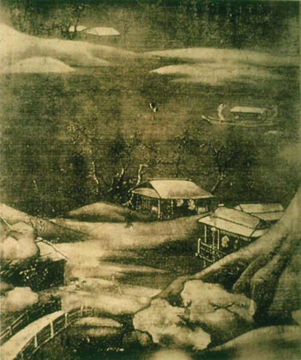

:::
:::

## Lù zhài 鹿柴

::: columns
::: {.column width="50%"}
空山不見人  
但聞人語響  
返景入深林  
復照青苔上  

<br>
<br>
Ken je alle pīnyīn?

:::

::: {.column width="50%" .fragment}
kōng shān bú jiàn rén  
dàn wén rén yǔ xiǎng  
fǎn jǐng rù shēn lín  
fù zhào qīng tái shàng 

:::
:::

## Lù zhài 鹿柴

* Dit type gedicht heet een *juéjù* 絕句, een Chinees kwatrijn
* De hoofdcesuur ｜ valt altijd na het tweede karakter
* Een secundaire cesuur 。 kan de laatste drie karakter verdelen in 1+2 of 2+1

. . .

::: columns
::: {.column width="50%"}
空山 | 不見。人  
但聞 | 人。語響  
返景 | 入。深林  
復照 | 青苔。上  


:::

::: {.column width="50%" .fragment}
kōng shān bú jiàn rén  
dàn wén rén yǔ xiǎng  
fǎn jǐng rù shēn lín  
fù zhào qīng tái shàng 

:::
:::

## Lù zhài 鹿柴 *Hertenloo* 

::: columns
::: {.column width="50%"}
空山 | 不見。人  
但聞 | 人。語響  
返景 | 入。深林  
復照 | 青苔。上  


:::

::: {.column width="50%"}
Lege bergen, er is niemand te zien,
alleen het geluid van stemmen weerklinkt.

Avondstrijklicht valt het dichte bos in,
op het blauwgroene mos glanst het weer op.

:::
:::

*vert. [Silvia Marijnissen](https://www.silviamarijnissen.nl/wang-wei-pei-di-bij-de-rivier-de-wang/)*

→ L[ijstje met andere vertalingen](https://www.hofhaan.nl/2004/martin-de-haan/landschappen-voor-wang-wei/)

## Maar, Wáng Wéi sprak natuurlijk geen Mandarijn!

Standaard Mandarijn Chinees (pǔtōnghuà 普通話) ontstond pas in de 20ste eeuw na de Vier Meibeweging.

Hoe klonk het dan wel?

En hoe konden Chinezen uit die tijd eigenlijk weten hoe een karakter werd uitgesproken?

## Basisfonologie

Fonologie is de studie van klanksystemen.

. . .

Chinese taalvariëteiten (lecten) hebben typisch:

* tonen
* beperkte lettergreepstructuur
* beperkte morfologie
* lettergrepen die onafhankelijk geanalyseerd kunnen worden (hoewel veel variëteiten grotendeels disyllabisch zijn)

## Lettergreepstructuur

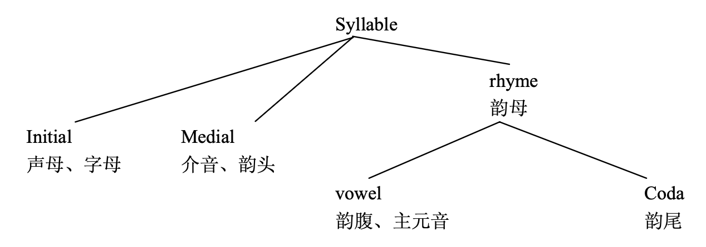


## Tonen (Mandarijn)

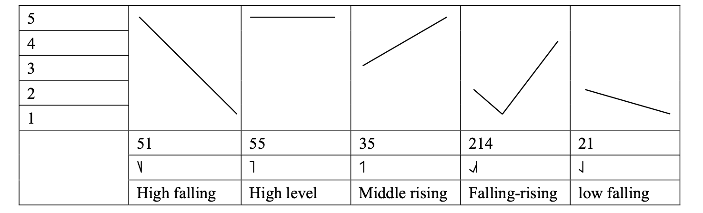

## Tonen (Kantonees)

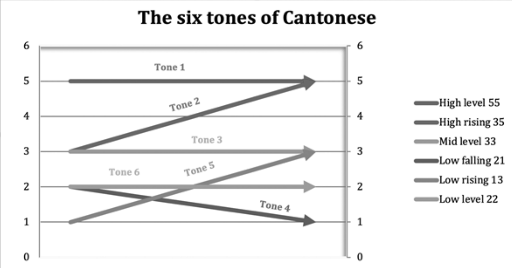

## Tonen (Kantonees)


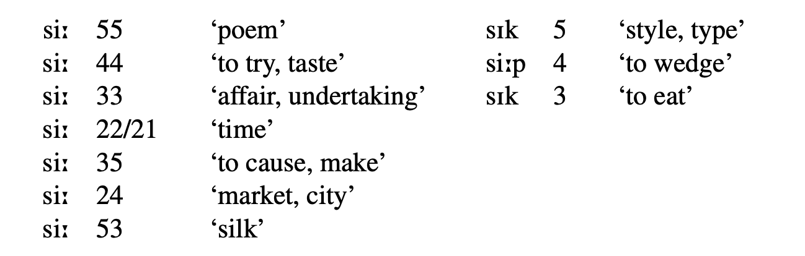

## Tonen (Southern Min / Taiwanees)

](inputfiles/tonen_taiwanees.webp)

## Tonen (Southern Min / Taiwanees)

](inputfiles/tonencirkel.svg)

## En in het Middelchinees (MC)?

::: columns
::: {.column width="50%"}
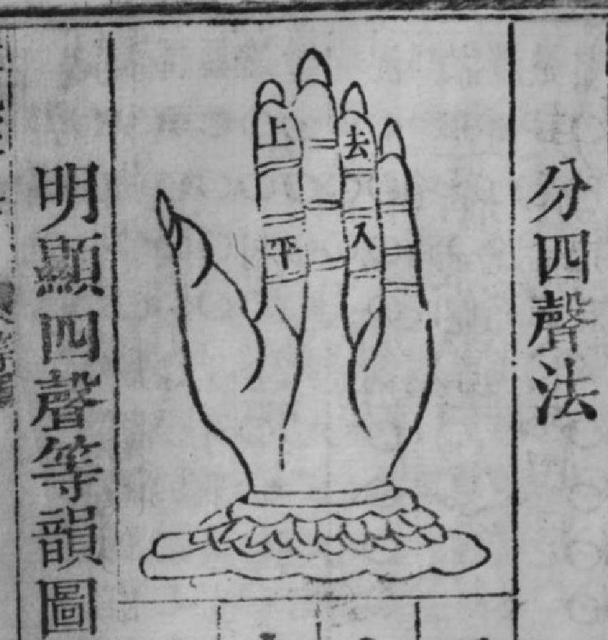

:::

::: {.column width="50%"}
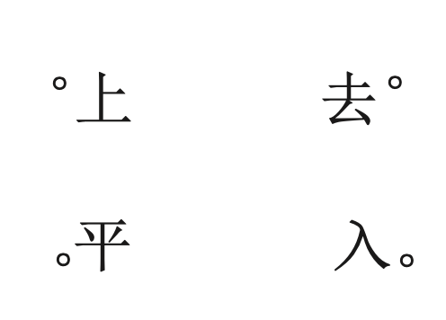

:::
:::

## Tonen (MC)

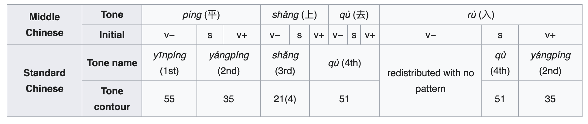
. . .

Maar dit zijn slechts tendensen, geen absoluut patroon!!

## De *rù*-toon 入聲

Aparte tooncategorie voor gesloten lettergrepen (*checked syllables*).

In de context van Chinese fonologie vind je dat voor:

* -p
* -t
* -k

Belangrijk: Mandarijn is die gesloten lettergrepen verloren doorheen de tijd.  
Een lettergreep kan enkel eindigen op een klinker of op /n/ of /ŋ/.  
Maar de gesloten lettergrepen (-p/t/k) komen nog wel voor in andere Chinese lecten.

## Samenvatting

Wáng Wéi sprak wellicht met tonen.
Daarvan waren er vier hoofdcategorieën (平上去入), die volgens sommige tradities worden onderverdeeld in een *yáng* en een *yīn* categorie, bv. 陽平、陰平.
De kans is groot dat zijn lect ook gesloten lettergrepen bevatte.

Nu kijken we eerst naar diachroon bewijs.

## Rijmwoordenboeken

* *Qièyùn* 《切韻》 (601, Suí)
* *Guǎngyùn* 《廣韻》(1008, Sòng)
* ...

Rijmwoordenboeken die, door het contact met India en de Sanskriettraditie, sleutels bevatten om de puzzel van karakteruitspraak op te lossen.

## Qièyùn

::: columns
::: {.column width="70%"}
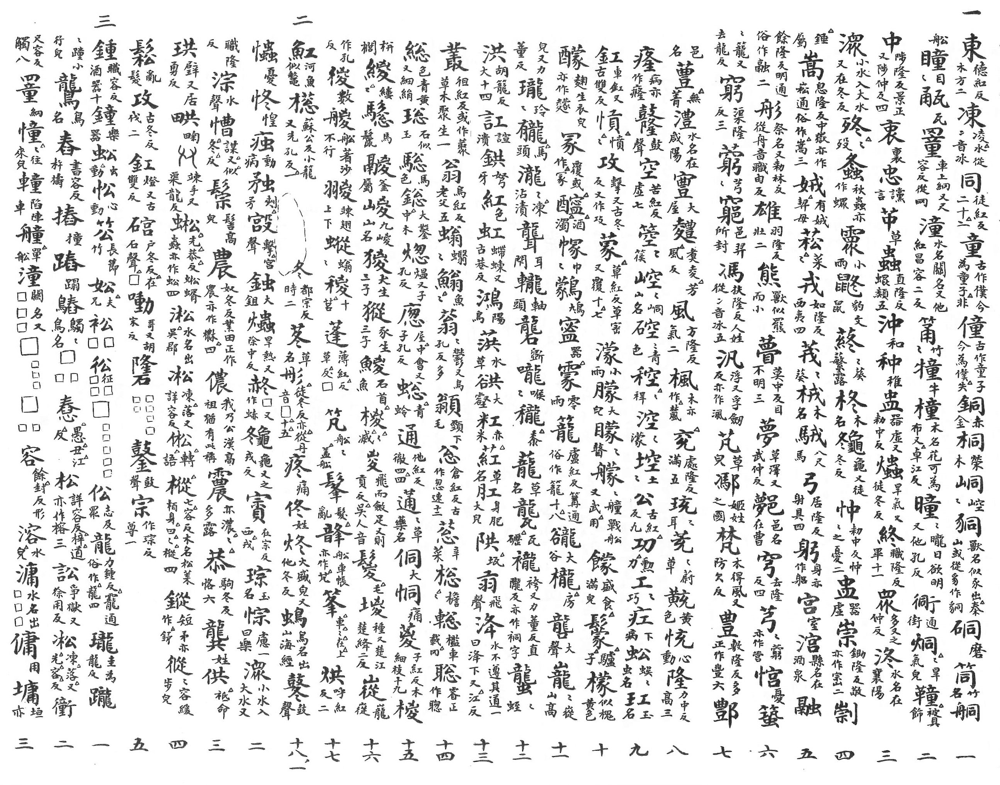


:::

::: {.column width="30%" .fragment}


:::

:::

## *Fǎnqiè* 反切

::: columns
::: {.column width="30%"}


:::

::: {.column width="70%"}
*fǎnqiè* systeem:

* initial → 德
* final → 紅
* "fǎn" 反 of "qiè" 切

→ De uitspraak van 【東】is de initial van 德 en de final van 紅. 
(Er is een beperkte set van karakters die gebruikt worden in de puzzel.)

. . .

* 「木方」 = de richting die overeenkomt met hout in de vijf-elementensysteem
* 「二」 = er zijn twee achtereenvolgende karakters die zo uitgesproken worden


:::
:::

## Vóór *fǎnqiè* was er *dúruò* 讀若

In oudere werken (bv. de *Shuōwén jiězì* 說文解字, Hàn) vind je ook een andere methode. 

Daar wordt 【東】 bv. geglost als 「東，動也」. 

## De klanken van het Middelchinees

Door middel van de rijmwoordenboekentraditie slaagt men erin om Chinese analyses te maken van hoe Middelchinese lettergrepen gestructureerd waren. 
Al in de Táng komt men tot een systeem van 30 verschillende initials, en later in de Sòng zelfs tot 36 initials (三十六字母).

Er zitten echter allerlei gaten in de analyse, en ook redundanties.
Het duurt nog tot in de Qīng (1842, Chén Lǐ 陳禮 met zijn *Qiè yùn kǎo*《切韻考》) eer het systeem echt op punt staat.

Groot "probleem": men blijft wel circulair Chinees gebruiken om dit aan te duiden.


## Bernhard Karlgren (1889-1978) (高本漢)

::: columns
::: {.column width="60%"}
* Zweeds sinoloog
* slavist van opleiding (Uppsala)
* talig genie
* zelf data verzameld in China (19 variëteiten, 1910-1912)
* *Grammata Serica* (1940)
* *Grammata Serica Recensa* (1957)
* belang: eerste die Europese historische taalkundige principes toepaste op Chinees

::: {.fragment}
* → kijken naar de huidige dialectverschillen om daardoor terug in de tijd te kunnen kijken

:::


:::

::: {.column width="40%"}


:::
:::

# Het talig landschap van China

*fāngyán* 方言 'topolect, regionalect'


---

 ](inputfiles/map_china_langs.png)

## 你吃饭了吗



## 你吃饭了吗 2



---

::: columns
::: {.column width="60%"}


::: {.fragment}
loempia, komt via het Indonesisch

:::

::: {.fragment}
oorspronkelijk van 潤餅 <br> ~~*rùnbǐng*~~ Hokkien lūn-piáⁿ

:::


:::

::: {.column width="40%"}
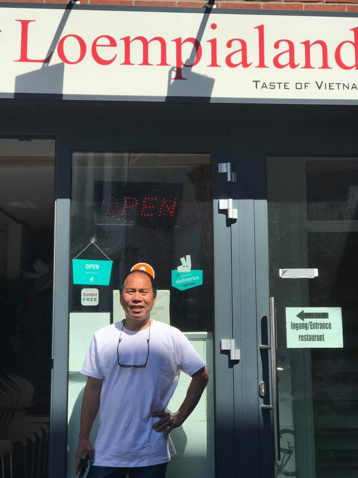

:::
:::

## Tea by sea, cha by land


## De big ten

 ](inputfiles/main_map_chinese.png)

## De big ten

::: columns
::: {.column width="50%"}
* Mandarin / Guānhuà 官話, 
  * Pǔtōnghuà  普通話
  * Hànyǔ 漢語
  * Zhōngwén 中文 (Mandarin speakers)
  * Guóyǔ 國語 (TW)
* Wú-yǔ 吳語
  * Suzhounese
  * Shanghainese
* Gàn-yǔ 贛語
* Xiāng-yǔ 湘語  (Hunanese)
* Mǐn(nán) 閩南語
  * Hokkien
  * Taiwanese Táiyǔ 台語
  * Southern Min

:::

::: {.column width="50%"}
* Hakka / Kèjiā-huà 客家話
* Yuè-yǔ 粵語
  * Cantonese Guǎngdōng-huà belangrijkste variant
* Jìn-yǔ 晉語 (wordt als Mandarijn beschouwd door conservatieve benaderingen)
* Huīzhōu-huà 徽州話 / Huīyǔ
* Píng-huà 平話

:::
:::


## Verschillen tussen de dialecten → reconstructie Middelchinees

Karlgren heeft het idee dat, buiten Mǐn 閩, de dialecten terug te voeren zijn op het Middelchinees (en verder het Oudchinees). 

* bv. pe**k**ing vs. běi-**j**īng (Mandarijn) vs. bak1-**g**ing1 (Cantonese) 
* bv. NL Japan < Maleisisch *Jepang* < Hokkien *Ji̍t-pún* < MC nyit-pwonX 日本

Daarvoor is het belangrijk om te weten hoe deze variëteiten zich tegenover elkaar verhouden.

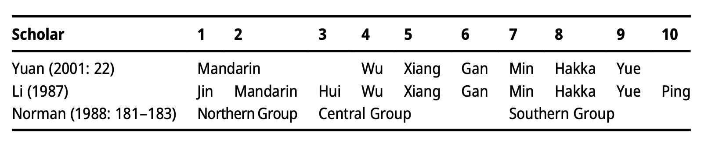

## Recente studie

Classificatie van Chinees kan gebeuren door te kijken naar fonologie, tonen, **woordenschat**, grammatica, voornaamwoorden etc.[Dit is een leesbaar overzicht.](https://en.wikipedia.org/wiki/Varieties_of_Chinese) 


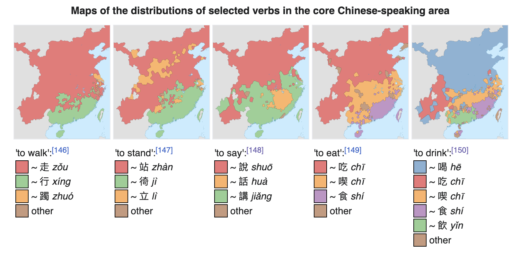

## Huang et al. (2024)'s dialectometrie

 ](inputfiles/paper_huang_grieve.png)

## 

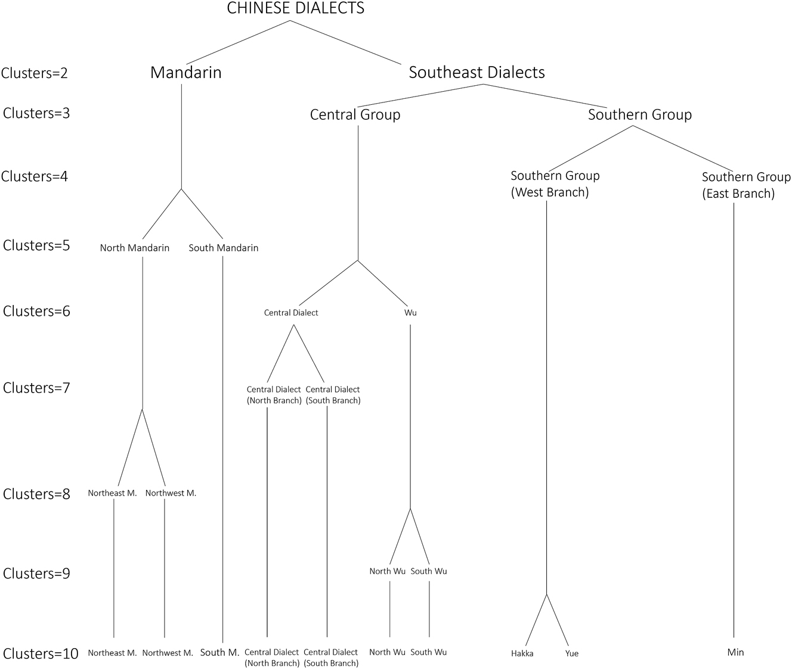 

##

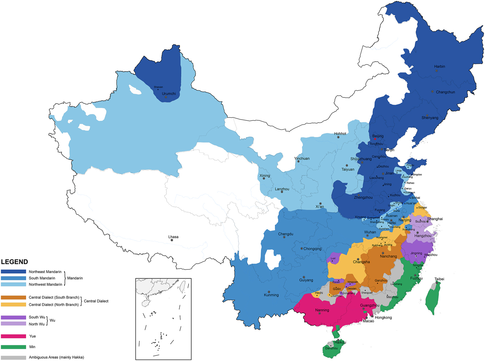


## MC Reconstructie: eerst zien


[見](https://en.wiktionary.org/wiki/%E8%A6%8B)

* *fǎnqiè*: 古電切 → iets "k-ien" achtigs
* (rijmtabellen: *qù*-toon)
* lecten
  * Mandarijn: jiàn [tɕien ˥˩]
  * Yuè: gin3
  * Gàn: jien4
  * Hakka: gienˇ
  * Jìn: jie3
  * Southern Mǐn: kìⁿ 
  * Wú: 5cien
  * Xiāng: jienn4

→ MC Karlgren: /kienH/


## En dan geloven

[信](https://en.wiktionary.org/wiki/%E4%BF%A1)

* *fǎnqiè*: 心真切 → iets "s-in|en" achtigs
* (rijmtabellen: *qù*-toon)
* lecten
  * Mandarijn: xìn [ɕin ˥˩]
  * Yuè: seon3
  * Gàn: xin4
  * Hakka: sinˇ
  * Jìn: xing3
  * Southern Mǐn: sìn 
  * Wú: 5sin
  * Xiāng: sin4

→ MC Karlgren: /si̯ĕnH/


## Updates voor MC

::: columns
::: {.column width="50%"}

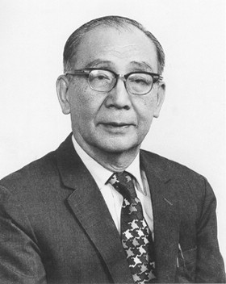


:::

::: {.column width="50%"}


:::
:::

## Updates voor MC

::: columns
::: {.column width="50%"}


:::

::: {.column width="50%"}


:::
:::

## Huidig meest aanvaarde reconstructie

[Baxter's reconstructie](https://en.wikipedia.org/wiki/Baxter%27s_transcription_for_Middle_Chinese) is momenteel het meest aanvaard.

Reconstructie |   見       |   信    |    微  |  初
--------------|----------|------------|-------|---- 
Mandarijn     |   jiàn    |    xìn    |  wēi   |  chū
Karlgren     |  kienH     |  si̯ĕnH   |   mwe̯i | ʈ͡ʂʰi̯wo
Pulleyblank  |  kɛnH      | sinH      |  muj   | ʈ͡ʂʰɨə̆
Baxter       |  kenH      |  sinH    |  mj+j  |  tsrhjo
IPA gebaseerd op Baxter |  kenH   |   sinH  |  mʲɨj |  ʈʂʰjo


→ **Het systeem van Baxter is ook het systeem dat jullie moeten gebruiken in de taak die bij deze les hoort.**

# De queeste voor Oudchinees

## Klanken buiten China (sino-xenische uitspraken)

De sinosfeer reikt tot in Korea, Japan, en Vietnam.

* Sino-Koreaans
* Sino-Vietnamees
* Sino-Japans (*on-yomi* 音読み, [hier](https://en.wikipedia.org/wiki/On%27yomi))
  * *go-on* 呉音 (5-6de E, invloed van Wú dialecten tijdens Noordelijke en Zuidelijke Dynastieën)
  * *kan-on* 漢音 (7-9de E, Táng dynastie)
  * *tō-on* 唐音 of *tō-sō-on* 唐宋音 (Sòng en Míng)

## Sino-xenische uitspraken: voorbeelden


```{r, echo=FALSE, message=FALSE}
library(dplyr)
library(gt)

examples <-
  tibble::tribble(
  ~ character, ~ Middle_Chinese, ~ Mandarin, ~ Cantonese, ~ Vietnames, ~ Korean, ~ Japanese_go, ~Japanese_kan, 
          
           "一 'one'",    "'jit",    "yī",           "yāt",   "nhất",     "il",    "ichi",    "itsu",
            "二 'two'",    "nyijH",   "èr",          "yih",   "nhị",     "i",     "ni",     "ji",
          "三 'three'",      "sam",  "sān",         "sāam",   "tam",   "sam",    "san",    "san",
           "四 'four'",     "sijH",   "sì",          "sei",    "tứ",    "sa",    "shi",    "shi",
           "五 'five'",     "nguX",   "wǔ",          "ńgh",   "ngũ",     "o",     "go",     "go",
            "六 'six'",    "ljuwk",  "liù",         "luhk",   "lục",  "lyuk",   "roku",   "riku",
          "七 'seven'",    "tshit",   "qī",         "chāt",  "thất",  "chil", "shichi", "shitsu",
          "八 'eight'",     "peat",   "bā",         "baat",   "bát",  "phal",  "hachi",  "hatsu",
           "九 'nine'",    "kjuwX",  "jiǔ",          "gáu",   "cửu",   "kwu",     "ku",    "kyū",
            "十 'ten'",    "dzyip",  "shí",         "sahp",  "thập",   "sip",     "jū",    "shū",
        "百 'hundred'",     "paek",  "bǎi",         "baak",  "bách",  "payk",  "hyaku",   "haku",
       "千 'thousand'",    "tshen", "qiān",         "chīn", "thiên",  "chen",    "sen",    "sen",
    "萬 '10 thousand'",    "mjonH",  "wàn",        "maahn",   "vạn",   "man",    "man",    "ban",
    "億 '100 million'",      "'ik",   "yì",          "yīk",    "ức",    "ek",    "oku",   "yoku",
         "明 'bright'",   "mjaeng", "míng",        "mìhng",  "minh", "myeng",    "myō",    "mei",
    "農 'agriculture'",    "nowng", "nóng",        "nùhng",  "nông",  "nong",     "nō",     "dō",
       "寧 'peaceful'",     "neng", "níng",        "nìhng",  "ninh", "nyeng",    "nyō",    "nei",
           "行 'walk'",    "haeng", "xíng",       "hàahng",  "hành", "hayng",    "gyō",     "kō",
        "請 'request'", "tshjengX", "qǐng", "chéng, chíng", "thỉnh", "cheng",    "shō",    "sei",
           "暖 'warm'",    "nwanX", "nuǎn",        "nyúhn",  "noãn",   "nan",    "nan",    "dan",
           "頭 'head'",      "duw",  "tóu",         "tàuh",   "đầu",   "twu",     "zu",     "tō",
          "子 'child'",     "tsiX",   "zǐ",           "jí",    "tử",    "ca",    "shi",    "shi",
           "下 'down'",     "haeX",  "xià",          "hah",    "hạ",    "ha",     "ge",     "ka"
  ) %>% 
  select(character, Mandarin, Cantonese, Middle_Chinese, everything())

examples %>% 
  slice_head(n = 14) %>% 
  gt() %>% 
  cols_align(align = "left") %>% 
  tab_options(
    table.background.color = "white",
    table.font.color = "black",

    column_labels.background.color = "white",
    column_labels.font.weight = "bold",

    # Minimalist lines (like booktabs)
    table.border.top.color = "black",
    table.border.top.width = px(2),
    table.border.bottom.color = "black",
    table.border.bottom.width = px(2),

    column_labels.border.bottom.color = "black",
    column_labels.border.bottom.width = px(1),

    table_body.hlines.color = "gray70",
    table_body.vlines.style = "none",

    row.striping.background_color = "white"
  )
  
```
## Sino-xenische uitspraken: voorbeelden

```{r}
examples %>% 
  slice_tail(n = 9) %>% 
  gt() %>% 
  cols_align(align = "left") %>% 
  tab_options(
    table.background.color = "white",
    table.font.color = "black",

    column_labels.background.color = "white",
    column_labels.font.weight = "bold",

    # Minimalist lines (like booktabs)
    table.border.top.color = "black",
    table.border.top.width = px(2),
    table.border.bottom.color = "black",
    table.border.bottom.width = px(2),

    column_labels.border.bottom.color = "black",
    column_labels.border.bottom.width = px(1),

    table_body.hlines.color = "gray70",
    table_body.vlines.style = "none",

    row.striping.background_color = "white"
  )
```


## Baxter & Sagart

::: columns
::: {.column width="33%"}
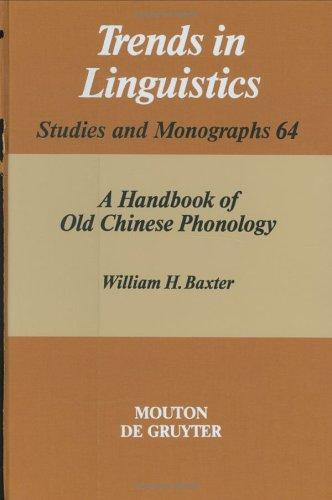

:::

::: {.column width="33%"}
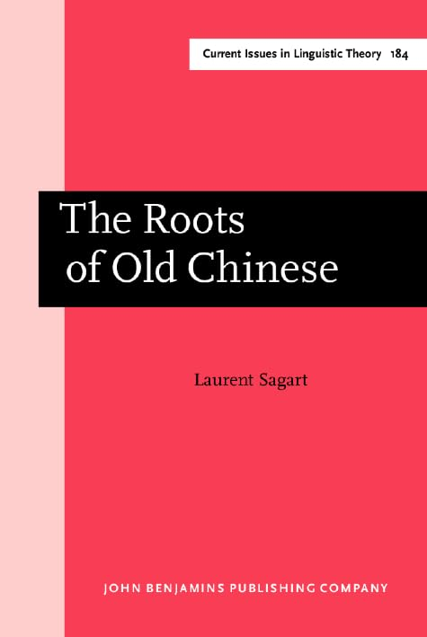

:::

::: {.column width="33%"}
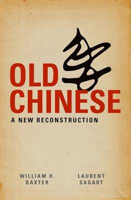

:::
:::


## Woordfamilies (*xiéshēng* 諧聲)

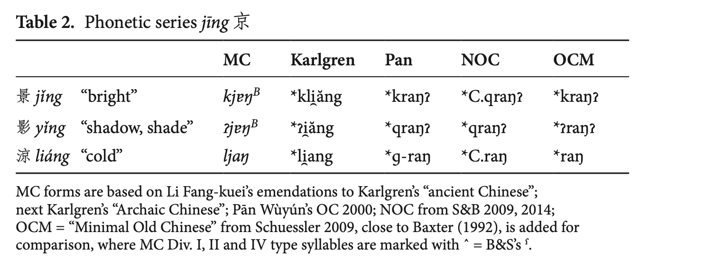

## Woordfamilies (*xiéshēng* 諧聲)

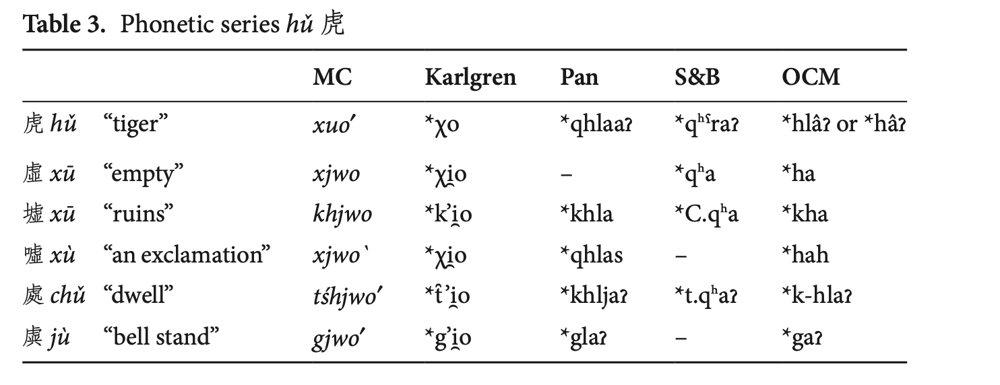

## Woordfamilies (*xiéshēng* 諧聲)

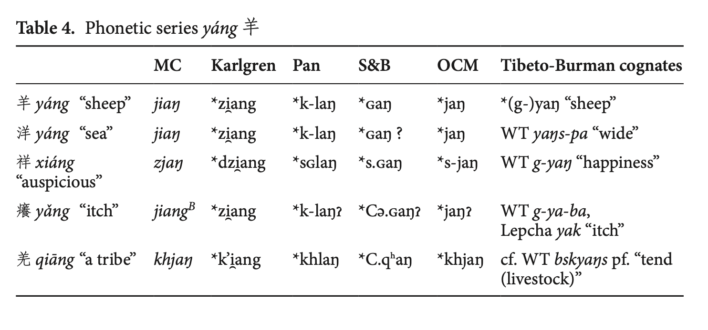


Merk op: Tibeto-Burman cognates worden ook bekeken

## Rijmpatronen in *Shījīng* 詩經

::: columns
::: {.column width="20%"}
采采芣苢，  
薄言[采]{.alert2}之。  
采采芣苢，  
薄言[有]{.alert2}之。  

采采芣苢，  
薄言[掇]{.alert2}之。  
采采芣苢，  
薄言[捋]{.alert2}之。  

采采芣苢，  
薄言[袺]{.alert2}之。  
采采芣苢，  
薄言[襭]{.alert2}之。

:::

::: {.column width="50%"}
cǎi cǎi foú yǐ，  
bó yán [cǎi]{.alert2} zhī。  
cǎi cǎi foú yǐ，  
bó yán [yǒu]{.alert2} zhī。  

cǎi cǎi foú yǐ，  
bó yán [duō]{.alert2} zhī。  
cǎi cǎi foú yǐ，  
bó yán [luō]{.alert2} zhī。  

cǎi cǎi foú yǐ，  
bó yán [jié]{.alert2} zhī。  
cǎi cǎi foú yǐ，  
bó yán [xié]{.alert2} zhī。  

:::


::: {.column width="20%"}
<br>
采 *s.r̥ˤəʔ  
<br>
有 *[ɢ]ʷəʔ  
<br>
<br>
掇 *t<r>ˤot  
<br>
捋 *[r]ˤot  
<br>
<br> 
袺 *C.qiː[d]  
<br>
襭  *ɡiːd  

:::


:::


Source: [Hill (2021)](https://youtu.be/-hopWQNPt54?si=sWTg0DMsseOG3k4I)


## Wat voor taal was Oudchinees?

* geen tonen (die komen pas later)
  * MC H (上)-toon komt van -s suffix
  * MC X (去)-toon komt van -ʔ suffix
* complexe lettergreep structuur
  * pre-syllabe
  * suffixen
* zes klinkers: \*i, \*e, \*u, \*o, \*a, \*ə

## Wat voor taal was Oudchinees?

Enkele voorbeelden:

* 初 Mand. chū < MC tsrhjo < OC *[ts]ʰra
* 見 Mand. jiàn < MC kenH < OC *[k]ˤen-s
* 信 Mand. xìn < MC sinH < OC *s-ni[ŋ]-s
* 響 Mand. xiǎng < MC xjangX < OC *qʰaŋʔ
* 復 Mand. fù < MC bjuwk < OC *m-p(r)uk

::: {.fragment}
Let op

* pre-syllabe
* suffix
* vierkante haakjes \[\]: onzekere reconstructie, maar er is iets van die aard
* ronde haakjes \(\): kan weggelaten worden zonder *reflexen* in latere stadia


:::


## Wat voor taal was Oudchinees?

Meer morfologie!

* wáng 王 'koning' vs. wàng 王 'koning zijn' terug te voeren op OC \*ɢʷaŋ vs. \*ɢʷaŋ-s (denominalisatie)
* chuán 傳 'doorgeven' vs. zhuàn 傳 'bron (het doorgegevene, "record")' terug te voeren op \*m-tron vs. \*N-tron-s (nominalisatie)
* jiàn 見 'zien' vs. xiàn 現 'verschijnen' terug te voeren op OC \*[k]ˤen-s vs. \*N-[k]ˤen-s


## *Het geluk van de vissen*

> 惠子曰：「子非魚，安知魚之樂？」

Huì-zǐ yuē: Zǐ fēi yú, ān zhī yú zhī lè?

\*ɢʷˤijs-tsəʔ ɢʷat: tsəʔ pəj ŋa, ʔan tre ŋa tə ŋrawk ?


## *Het geluk van de vissen*

> 惠子曰：「子非魚，安知魚之樂？」


Verborgen woordspeling die een gewone grammaticale lezing van de tekst mist:

魚 yú < OC [\*ŋa]{.alert2}

::: columns
::: {.column width="50%"}
1ste persoon

* [\*ŋa]{.alert2} 吾
* \*ŋajʔ 我 
* \*ŋaŋ 卬

:::

::: {.column width="50%"}
Eerder

* \*lja 余
* \*ljaʔ 予
* \*ljə 台  
* \*lrjəmʔ 朕

:::
:::


## *Het geluk van de vissen*

> 莊子曰：「鯈魚出遊從容，是魚之樂也。」

Wat is 從容?

::: {.fragment}
*cōngróng* (of *cóngróng*)

'vredig, vrolijk; in groten getale'

MC tshjowng~yowng < OC *zloŋ~loŋ

Dit is een voorbeeld van een zeldzaam tweelettergrepig enkel morfeem in het Oudchinees. Dit woord beeldt (Eng. *depicts*) een zintuiglijke ervaring uit. Deze woordsoord noemen we ook een [ideofoon]{.alert2} (of *mimetic* of *expressive*).

:::


# Hoe sprak een Confucius?

Daar hebben we nu dus wel een aardig idee van:



# Hoe sprak een Wáng Wéi?

Ook dit weten we nu.

Dit is de meest gemakkelijke manier om dat te achterhalen.

Stap 1. Surf naar https://en.wiktionary.org/  
Stap 2. Zoek naar het gewenste karakter (best traditionele variant)  
Step 3. Zoek naar Middelchinees en Oudchinees (bij twijfel kies de Baxter/Baxter-Sagart variant).

## Lù zhài 鹿柴 < MC luwk dzrea

::: columns
::: {.column width="50%"}
空山不見人  
但聞人語響  
返景入深林  
復照青苔上  

kōng shān bú jiàn rén  
dàn wén rén yǔ xiǎng  
fǎn jǐng rù shēn lín  
fù zhào qīng tái shàng  
:::

::: {.column width="50%"}
khuwng srean pjut kenH nyin  
danX mjun nyin ngjoX xjangX  
pjon kjaengX nyip syim lim  
bjuwk tsyewH tsheng doj dzyangH  
(Baxter)  
<br>
kʰuŋ ʂɛn pjut̚ kenH ɲin    
dan mjun ɲin ŋjoX xjaŋX  
pjonX kjængX ɲip çim lim  
bjuwk̚ cewH tsʰeŋ doj ɟaŋH  
(IPA based on Baxter)


:::
:::

## Haiku

Hoe maak je een haiku?

::: {.fragment}
5, 7, 5 lettergrepen (eigenlijk morae)

Op dezelfde manier bevatten veel Chinese Tánggedichten formele kenmerken.
Bv. in hun toonpatronen.


:::


## Toonpatronen en rijm

Regel 1. Er zijn twee groepen tonen

* *píng* 平 (|) → 平
* *zè* 仄 (-) → 上、去、入

Regel 2. Tonen moeten maximaal contrasteren in een regel

* Patroon A: | | - - |
* Patroon B: - - | | -
* Patroon C: - - - | |
* Patroon D: | | | - -

Regel 3. B en D moeten rijmen


## Toonpatronen en rijm

Regel 4. Tonen moeten maximaal constrasteren tussen regels

* A kan nooit A volgen enz.
* A dan B
* C dan D


Regel 5. *nián* 黏 'vastlijmen' van coupletten

* AB, dan CD
* CD, dan AB
* variatie: DB, dan CD
* variatie: BD, dan AB

Vaak veel meer variatie in *juéjù* (zoals we zien in ons voorbeeld).


## Lù zhài 鹿柴 < MC luwk dzrea

::: columns
::: {.column width="50%"}
空山 | 不見。人  
但聞 | 人。語響  
返景 | 入。深林  
復照 | 青苔。上
  
khuwng srean pjut kenH nyin  
dan mjun nyin ngjoX xjangX  
pjonX kjaengX nyip syim lim  
bjuwk tsyewH tsheng doj dzyangH  
<br>
*kʰuŋ ʂɛn pjut̚ kenH ɲin*    
*dan mjun ɲin ŋjoX xjaŋX*  
*pjonX kjængX ɲip çim lim*  
*bjuwk̚ cewH tsʰeŋ doj ɟaŋH*  

:::

::: {.column width="50%"}

::: {.fragment}
[\- - | | -  (patroon B)]{.alert2}
:::
::: {.fragment}
[\- - - | |  (patroon C)]{.alert2}
:::
::: {.fragment}
[\| | | - -  (patroon D)]{.alert2}
:::
::: {.fragment}
[\| | - - | (patroon A)]{.alert2}
:::


:::
:::

# Conclusie

## Takeaways

Reconstructie Middelchinees MC

* rijmwoordenboeken
* lecten van China

Reconstructie Oudchinees OC

* start vanaf MC
* sino-xenische uitspraken
* woordfamilies
* rijmpatronen

Hoe meer variëteiten je in kaart brengt, hoe dieper je kan gaan. Dus word je bewust van variatie

## Takeaways


Er zit meer in een geregulariseerd kwatrijn (*juéjù*) dan je zou denken.

* rijmpatronen
* cesuurstructuur
* toonpatronen
* (antithetisch parallellisme)


## Opdracht

1. Chinese naam  
1a. Schrijf je Chinese naam in simplified en traditionele karakters  
1b. Onderzoek via Wiktionary de uitspraak van je naam in Mandarijn, Middelchinees, Oudchinees (focus op de reconstructies van Baxter)

2. Gedicht  
2a. Je krijgt een kwatrijn. Transcribeer in Mandarijn en één ander grote lectale groep van China (bv. Yuè, Wú, Mǐn etc.).  
2b. Transcribeer in Middelchinees (volg de reconstructie van Baxter).  
2c. Reflecteer kort over het verschil tussen Mandarijn, je gekozen lect, en Middelchinees. Hoe verschillen ze? Waar zijn ze gelijkaardig? Verrast dit je?

3. Voor de liefhebber  
3a. Bespreek de tonale patronen van je toegewezen gedicht.  
3b. Vertaal het gedicht.


      

